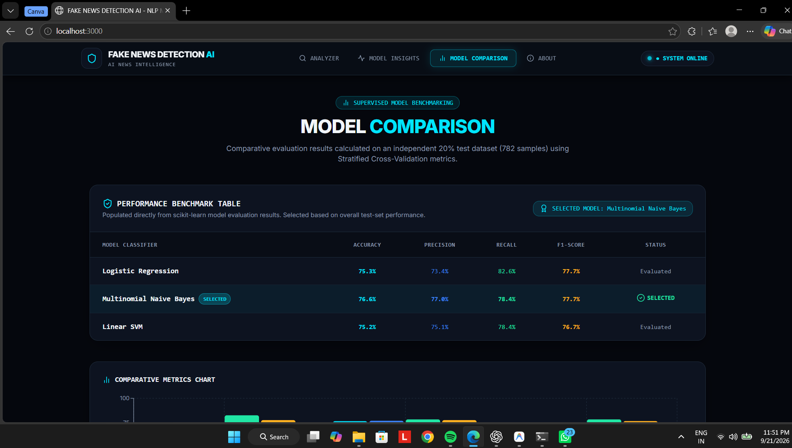
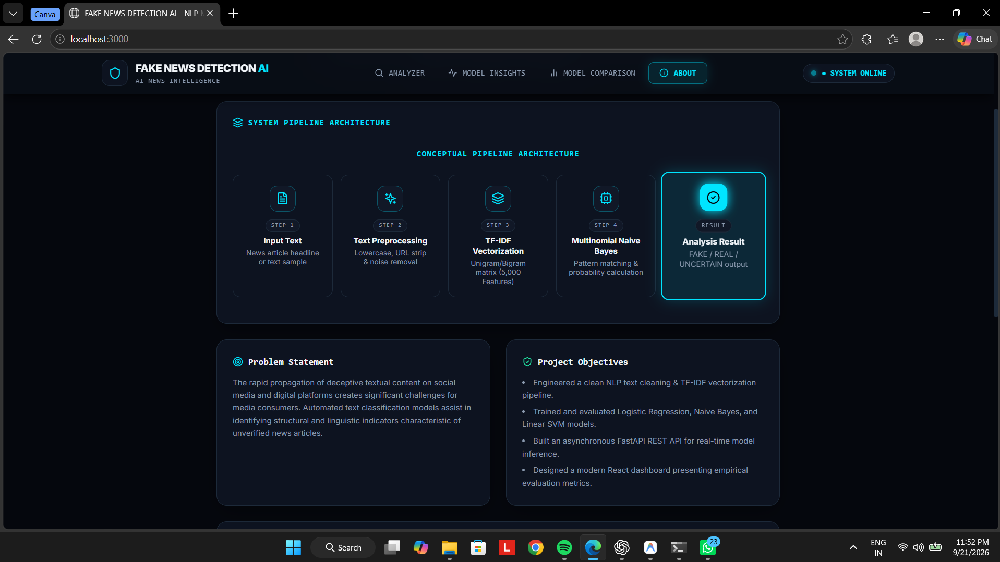

# FAKE NEWS DETECTION AI

### Machine Learning-Based News Classification Using Natural Language Processing

A full-stack academic machine learning project that classifies news text as **FAKE**, **REAL**, or **UNCERTAIN** using NLP, TF-IDF feature extraction, and Multinomial Naive Bayes.

The project includes a **FastAPI backend**, **React + TypeScript frontend**, trained ML artifacts, evaluation scripts, Jupyter notebook, documentation, and academic presentation materials.

> **Important:** This system performs statistical text classification based on patterns learned from the training data. It does not perform live internet fact verification and should not be treated as an authoritative source of truth.

---

## 📌 Project Overview

Fake news and misleading information can spread rapidly through digital platforms. This project explores how supervised machine learning and natural language processing can be used to classify news text based on linguistic patterns present in a labeled dataset.

The system processes a news headline or text, transforms it into numerical TF-IDF features, and uses a trained Multinomial Naive Bayes classifier to produce a class prediction and probability-based output.

### Prediction States

- **FAKE** — The learned patterns show stronger association with the FAKE class.
- **REAL** — The learned patterns show stronger association with the REAL class.
- **UNCERTAIN** — The model does not show sufficiently strong class association.

---

## ✨ Features

- News text classification using machine learning
- NLP-based text processing
- TF-IDF feature extraction
- Multinomial Naive Bayes classification
- Probability-based confidence output
- FAKE / REAL / UNCERTAIN prediction states
- Model performance comparison
- Confusion matrix evaluation
- FastAPI REST API
- React + TypeScript interface
- Model insights dashboard
- Model comparison dashboard
- Jupyter notebook for academic experimentation
- Serialized model and TF-IDF artifacts
- Academic report and presentation documentation

---

## 🏗️ System Architecture

```text
                  NEWS TEXT INPUT
                        |
                        v
              +---------------------+
              | Text Preprocessing  |
              +----------+----------+
                         |
                         v
              +---------------------+
              |   TF-IDF Features   |
              |    5,000 Features   |
              +----------+----------+
                         |
                         v
              +---------------------+
              | Multinomial Naive   |
              |       Bayes         |
              +----------+----------+
                         |
                         v
              +---------------------+
              | Probability-Based   |
              |      Output         |
              +----------+----------+
                         |
             +-----------+-----------+
             |           |           |
             v           v           v
           FAKE        REAL      UNCERTAIN
```

---

## 🧠 Machine Learning Methodology

The project follows a supervised text classification pipeline:

1. Dataset loading
2. Text cleaning and normalization
3. Train/test splitting
4. TF-IDF feature extraction
5. Model training
6. Model evaluation
7. Confusion matrix analysis
8. Model selection based on overall test-set performance
9. Serialization of the selected model and vectorizer
10. Deployment through FastAPI
11. Integration with the React frontend

### Feature Extraction

The project uses **TF-IDF (Term Frequency-Inverse Document Frequency)** to convert textual input into numerical feature representations.

The final vectorizer uses:

- **5,000 features**

---

## 📊 Dataset

The modeling workflow contains:

| Dataset Property | Value |
|---|---:|
| Raw records | 4,056 |
| Records removed during cleaning | 147 |
| Cleaned samples | 3,909 |
| FAKE samples | 1,876 |
| REAL samples | 2,033 |
| Training samples | 3,127 |
| Test samples | 782 |
| Train/Test split | 80/20 |
| Split strategy | Stratified |

### Class Distribution

- **REAL:** 2,033 samples
- **FAKE:** 1,876 samples

---

## 🤖 Models Evaluated

Three supervised machine learning algorithms were evaluated:

1. Logistic Regression
2. Multinomial Naive Bayes
3. Linear Support Vector Machine

### Model Comparison

Evaluation was performed on **782 test samples**.

| Model | Accuracy | Precision | Recall | F1-Score |
|---|---:|---:|---:|---:|
| Logistic Regression | 75.3% | 73.4% | 82.6% | 77.7% |
| **Multinomial Naive Bayes** | **76.6%** | **77.0%** | **78.4%** | **77.7%** |
| Linear SVM | 75.2% | 75.1% | 78.4% | 76.7% |

### Selected Model

**Multinomial Naive Bayes**

The model was selected based on its overall performance on the test set.

---

## 📈 Multinomial Naive Bayes Confusion Matrix

Evaluation on the **782-sample test set** produced:

| Metric | Value |
|---|---:|
| True Negative (TN) | 280 |
| False Positive (FP) | 95 |
| False Negative (FN) | 88 |
| True Positive (TP) | 319 |

### Final Model Metrics

- **Accuracy:** 76.6%
- **Precision:** 77.0%
- **Recall:** 78.4%
- **F1-Score:** 77.7%

---

## 🖥️ Web Application

The project provides a web interface built using React and TypeScript.

### Main Sections

- **Analyzer**
- **Model Insights**
- **Model Comparison**
- **Report & Presentation**
- **About**

The Analyzer allows users to enter news text and receive a machine learning prediction with a probability-based output.

---

## 🛠️ Technology Stack

### Machine Learning

- Python
- Scikit-learn
- TF-IDF
- Multinomial Naive Bayes
- Logistic Regression
- Linear SVM
- Jupyter Notebook

### Backend

- FastAPI
- Uvicorn
- Pydantic
- Joblib

### Frontend

- React
- TypeScript
- Vite
- Tailwind CSS
- Recharts

### Development Tools

- Git
- GitHub
- VS Code

---

## 📁 Project Structure

```text
fake-news-detection-ai/
│
├── backend/
│   ├── app/
│   │   ├── main.py
│   │   ├── routes/
│   │   ├── services/
│   │   └── schemas/
│   │
│   ├── data/
│   │   └── news_dataset.csv
│   │
│   ├── models/
│   │   ├── best_model.joblib
│   │   ├── tfidf_vectorizer.joblib
│   │   └── metrics.json
│   │
│   ├── training/
│   ├── test_backend.py
│   └── requirements.txt
│
├── frontend/
│   ├── src/
│   ├── package.json
│   ├── tailwind.config.js
│   ├── tsconfig.json
│   └── vite.config.ts
│
├── notebooks/
│   └── fake_news_detection.ipynb
│
├── docs/
│   └── screenshots/
│       ├── analyzer.png
│       ├── model-insights.png
│       ├── model-comparison.png
│       └── about.png
│
├── README.md
└── .gitignore
```

---

## ⚙️ Installation & Setup

### 1. Clone the Repository

```bash
git clone https://github.com/kushagra-163/fake-news-detection-ai.git
cd fake-news-detection-ai
```

---

## 🐍 Backend Setup

Navigate to the backend:

```bash
cd backend
```

Create and activate a Python virtual environment if required, then install the dependencies listed in:

```text
requirements.txt
```

Run the FastAPI server:

```bash
python -m uvicorn app.main:app --host 127.0.0.1 --port 8000 --reload
```

### API

Base API:

```text
http://127.0.0.1:8000/api
```

Interactive Swagger documentation:

```text
http://127.0.0.1:8000/docs
```

---

## 🌐 Frontend Setup

Open another terminal:

```bash
cd frontend
```

Install dependencies:

```bash
npm install
```

Start the development server:

```bash
npm run dev
```

Open the URL displayed by Vite in the terminal.

---

## 🧪 Model Training

The training pipeline is located inside:

```text
backend/training/
```

The training workflow follows:

```text
Dataset
   |
   v
Cleaning & Normalization
   |
   v
Train/Test Split
   |
   v
TF-IDF Feature Extraction
   |
   v
Model Training
   |
   v
Model Evaluation
   |
   v
Model Artifacts
```

Generated artifacts include:

```text
backend/models/
├── best_model.joblib
├── tfidf_vectorizer.joblib
└── metrics.json
```

---

## 📸 Project Screenshots

### News Analyzer


### Model Insights


### Model Comparison



### About & System Architecture



---

## ⚠️ Limitations

- The model learns statistical patterns from the available training data.
- Predictions are not equivalent to factual verification.
- The system does not perform live internet searches to verify claims.
- Performance depends on the quality and distribution of the training dataset.
- News from domains or writing styles not sufficiently represented in the training data may produce uncertain or incorrect predictions.
- Confidence values represent model output and should not be interpreted as proof of factual correctness.

---

## 🔮 Future Scope

Possible future improvements include:

- Larger and more diverse datasets
- Transformer-based NLP models
- BERT/RoBERTa-based classification
- Real-time news source integration
- Evidence retrieval and claim verification
- Source credibility analysis
- Explainable AI techniques
- Multilingual fake news detection
- Continuous model evaluation
- Production deployment

---

## 📚 Academic References

1. Shu, K., Mahudeswaran, D., Wang, S., Lee, D., & Liu, H. (2020). *FakeNewsNet: A Data Repository with News Content, Social Context, and Spatiotemporal Information*. Big Data, 8(3), 171–188.

2. Pedregosa, F. et al. (2011). *Scikit-learn: Machine Learning in Python*. Journal of Machine Learning Research.

3. FastAPI Documentation.

4. React Documentation.

---

## ⚠️ Disclaimer

> This project is developed for academic and educational purposes. The prediction represents statistical patterns learned by the machine learning model and does not independently establish whether a news claim is factually true or false.

---

## 👨‍💻 Author

**Kushagra Vispute**

B.Tech — Artificial Intelligence & Data Science

GitHub:  
https://github.com/kushagra-163

---

## ⭐ Project

If you find this project useful for learning about NLP, machine learning, or full-stack AI applications, consider giving the repository a star.